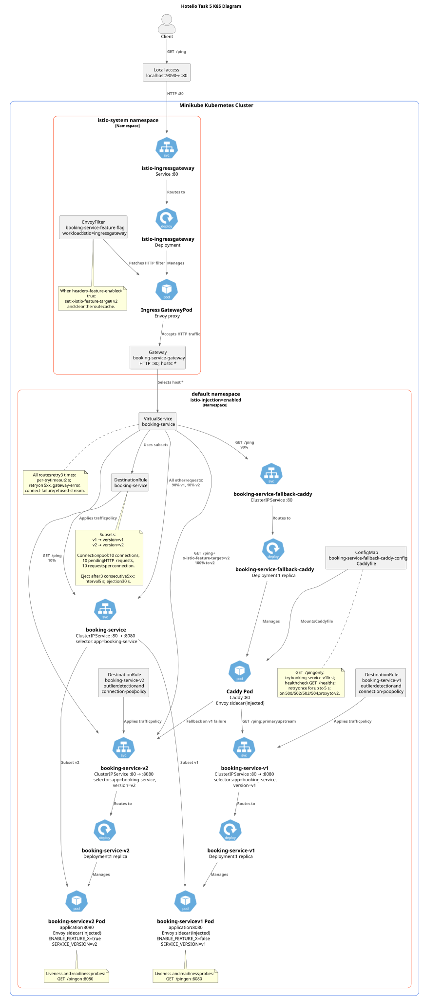

# Task 5: Istio Traffic Management

This directory contains the runnable implementation of Task 5: two `booking-service` versions, Istio traffic management, and a Caddy fallback proxy.

## Deployment diagram

<details>
    <summary>Hotelio Task 5 K8S Diagram</summary>



</details>

## Prerequisites

- Docker, Minikube, Helm, `kubectl`, and `istioctl` are installed.
- Minikube is running.
- The `booking-service:latest` image is built and loaded into Minikube.

```bash
docker build -t booking-service:latest booking-service
minikube image load booking-service:latest
```

Install Istio and enable automatic sidecar injection before deploying the application:

```bash
istioctl install --set profile=demo -y
kubectl label namespace default istio-injection=enabled --overwrite
```

## Deploy the stack

Deploy v1 first. It creates the shared `booking-service` Service. Then deploy v2 and Caddy.

```bash
helm upgrade --install booking-service-v1 helm/booking-service \
  --values helm/booking-service/values.v1.yaml

helm upgrade --install booking-service-v2 helm/booking-service \
  --values helm/booking-service/values.v2.yaml

helm upgrade --install booking-service-fallback-caddy helm/caddy
```

Apply the Istio resources:

```bash
kubectl apply -f istio/destination-rule.yaml
kubectl apply -f istio/envoy-filter.yaml
kubectl apply -f istio/virtual-service.yaml
```

Expose the Istio ingress gateway locally in a separate terminal:

```bash
kubectl -n istio-system port-forward service/istio-ingressgateway 9090:80
```

## Validate the stack

Run the checks from this directory:

```bash
bash ./check-istio.sh
bash ./check-canary.sh
bash ./check-feature-flag.sh
```

For the fallback check, stop v1, run the script, then restore v1:

```bash
kubectl -n default scale deployment \
  -l app=booking-service,version=v1 \
  --replicas=0

bash ./check-fallback.sh

kubectl -n default scale deployment \
  -l app=booking-service,version=v1 \
  --replicas=1
```

The fallback check passes only when `GET /ping` returns `pong v2`.
